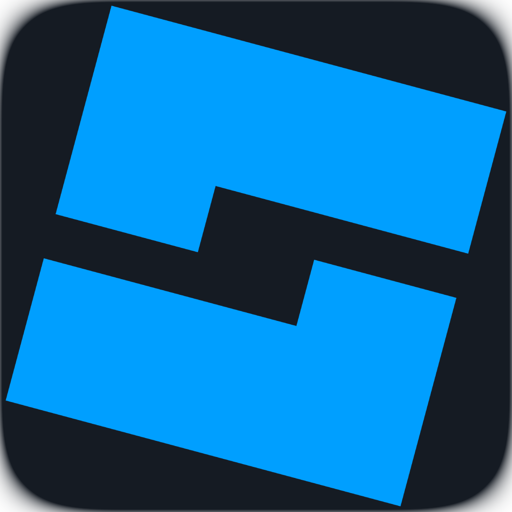

<h1 align="center">Hi 👋, I'm Alfath!</h1>

<h3 align="center">
  🎮 Game Developer • 💻 Software Developer • 🚀 Builder
</h3>

<p align="center">
  <a href="https://github.com/Allppatt">
    
  </a>
  
</p>

---

## 👨‍💻 About Me

```yaml
name: Alfath
location: Indonesia
education: Software & Game Development Student

currently_learning:
  - Luau
  - C#
  - Web Development
  - Game Development

interests:
  - Roblox Development
  - Game Development
  - Software Engineering
  - UI/UX
  - Open Source

goal: Build engaged and fun digital experiences 🚀
```

---

## 🛠️ Tech Stack

### Languages

<p align="left">
  
  
  
  
  
  
</p>

### Tools & Frameworks

<p align="left">
  
  
  
  
  
  
  
</p>

<table align="center" width="100%"> <tr> <td width="50%" align="center">  </td> <td width="50%" align="center">  </td> </tr> </table>

---

# 📊 GitHub Analytics

<table align="center" width="100%"> <tr> <td width="50%" align="center">  </td> <td width="50%" align="center">  </td> </tr> </table>

---

# 📈 Contribution Activity

<p align="center">  </p>

---

# 📦 GitHub Overview

<table align="center" width="100%"> <tr> <td width="50%" align="center">  </td> <td width="50%" align="center">  </td> </tr> </table>

---

# 📅 Commit Activity

<p align="center">
  
</p>

---

# 🌐 Connect With Me

<p align="center">

  <a href="https://instagram.com/allppatt_16">
    
  </a>

  <a href="https://discord.com/users/Allppatt">
    
  </a>

  <a href="https://www.roblox.com/users/1658790507/profile">
    
  </a>

  <a href="https://www.roblox.com/communities/33792861/ASPIKO-Labs#!/about">
    
  </a>

  <a href="https://www.linkedin.com/in/muhammad-alfathdry-r-908845361/">
    
  </a>

  <a href="https://Allppatt.itch.io">
    
  </a>

</p>

---

<p align="center">
  
</p>

<p align="center">
  <i>Building things, learning every day, and turning ideas into reality. 🚀</i>
</p>
